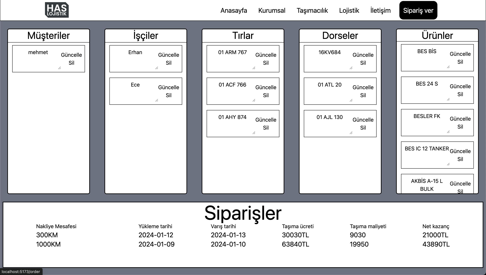

<h1 align="center">HasLogistics<h1>

**HasLogistics** is a logistics management application that allows customers to handle their logistics operations via an order-based system. With a user-friendly interface and powerful backend support, HasLogistics makes managing logistics tasks efficient and seamless.

---

## Features

- **Order-Based Logistics Management**: Customers can easily create and manage logistics requests.
- **Real-Time Status Updates**: Track your logistics requests in real time.
- **Secure Data Handling**: Built with a robust PostgreSQL database for reliable and secure data storage.
- **User-Friendly Interface**: Intuitive design for a smooth customer experience.

---

## Screenshots

1. **Admin Page**:
   

2. **Home Page**:
   

3. **Order Page**:
   

4. **Storage Service Page**:
   

---

## Technologies Used

### **Frontend**
- **React**: For creating the interactive user interface.
- **CSS/Styled Components**: For building responsive and modern designs.

### **Backend**
- **Node.js**: Backend framework to handle server-side operations.
- **PostgreSQL**: Database used for secure and efficient data storage.
- The backend source code is available in a separate repository: [HasLogisticsBackend](https://github.com/qrivnel/HasLogisticsBackend).

---

## Setup and Usage

### Prerequisites
Ensure you have the following installed on your system:
- **Node.js**
- **PostgreSQL**
- A package manager like **npm** or **yarn**

### 1. Clone the Repository
```bash
git clone https://github.com/qrivnel/HasLogistics.git